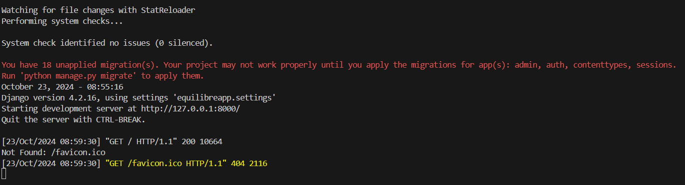
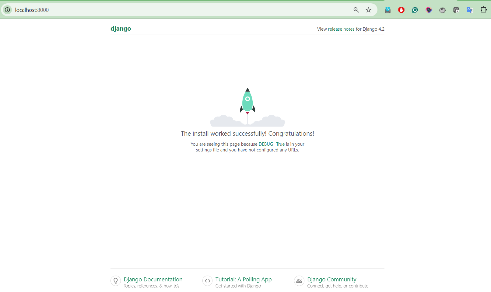
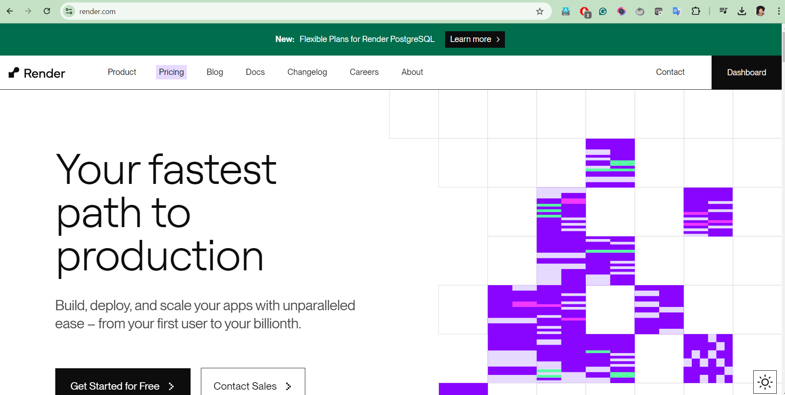
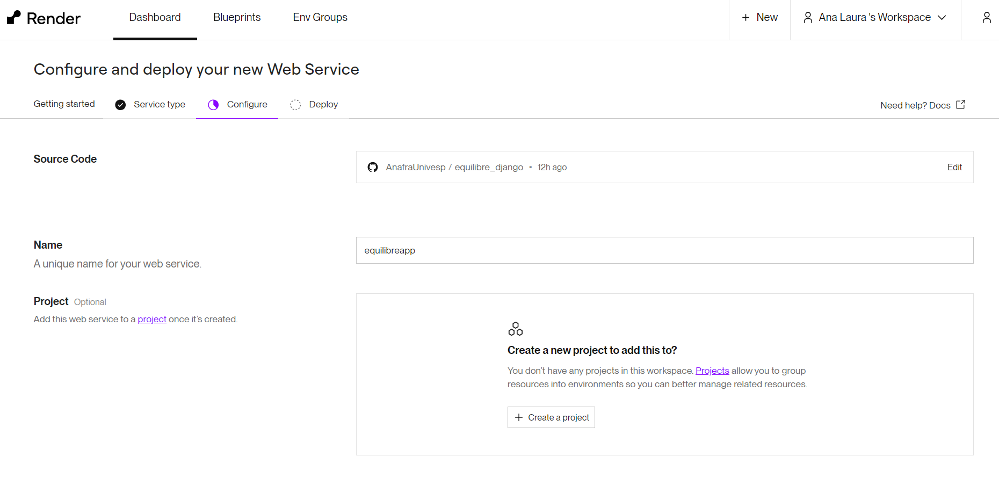
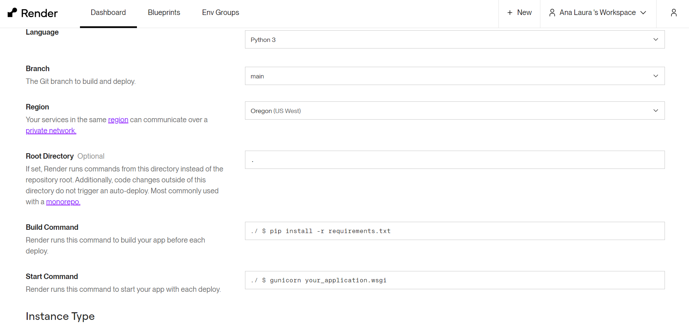
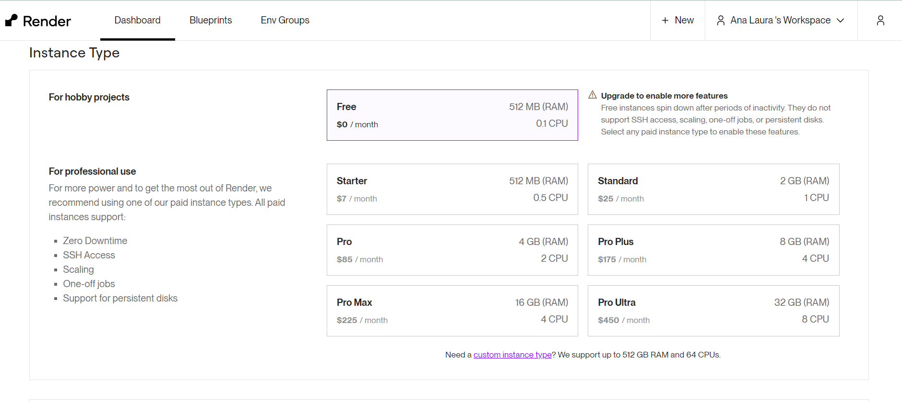
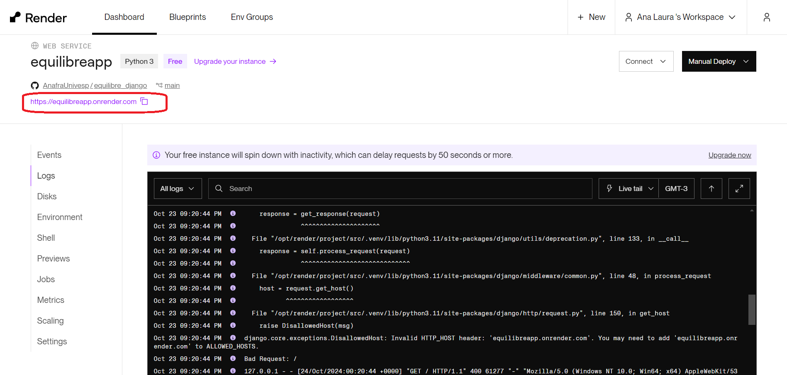
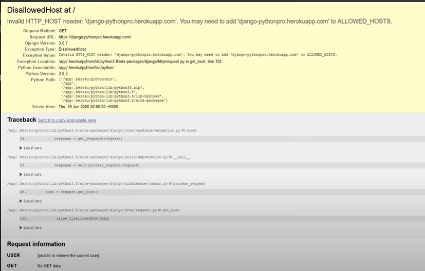
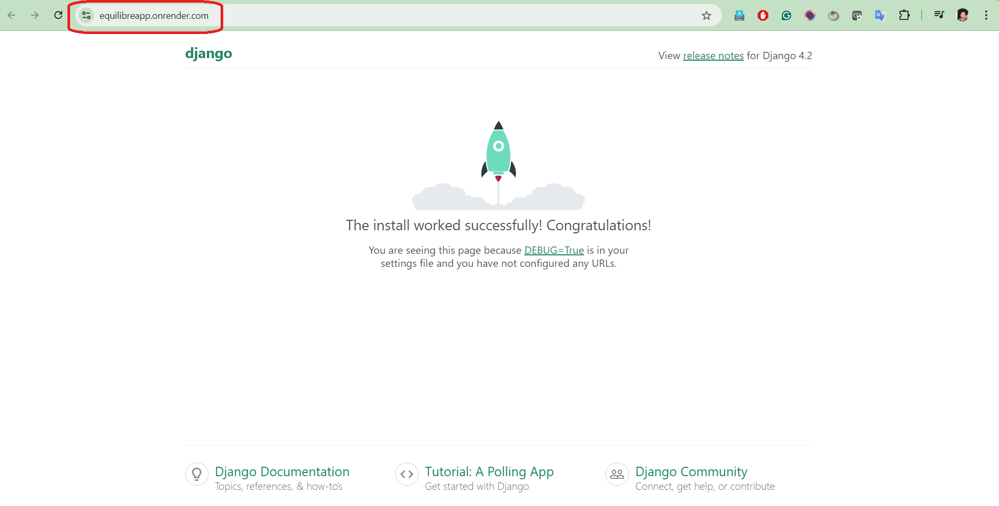

## equilibre_django

## Pré-Requisitos

- Instalar o **Django**
- Instalar o **Python**
- Instalar **Visual Studio** ou a IDE da sua preferência que execute Python
- Possuir uma conta no **Github**

> Lembrando que são comandos para Windows

## Getting Started 

Comando para **criar um env** (ambiente) dentro do meu diretório.

```
python -m venv venv

```

Neste trecho eu **ativo o ambiente virutual** no meu prompt (cmd)
```
.\venv\Scripts\activate

```
A aplicação entrará no modo ambiente local:

exemplo
> <font colo="green">(venv) PS C:\Users\Usuario\Documents\Univesp\pi02_v2\equilibre_django> </font>


Neste trecho houve a instalação do **django** mais a **biblioteca** <font color="red">**gunicor**</font>

> O gunicor é um **servidor de aplicação** que atende as requisições do nosso servidor.

```
pip install django gunicorn

```

Caso seja solicitado **atualize a versão do pip**  utilizando o seguinte comando:

```
python.exe -m pip install --upgrade pip

```

Para **iniciarmos um novo projeto** utilizamos o **django-admin**, mas caso eu queria investigar quais são os outros comando que compõem o admin-django utilize o comando abaixo:

```
admin-django --help

``` 

## Iniciando o Projeto

1. Retorne à pasta raiz do projeto 

Para iniciar um novo projeto utilize o comando abaixo:

```
admin-django startproject NOMEDOPROJETO .

``` 
Obs. o caractere de ponto significa que eu estou **indicando** a instalação no diretório raiz. 

2. Confira se a pasta projeto foi criada e seus principais arquivos:

Exemplo:

```
Mode                 LastWriteTime         Length Name
----                 -------------         ------ ----
d-----        23/10/2024     08:46                equilibreapp
d-----        23/10/2024     08:18                venv
-a----        23/10/2024     07:49           3301 .gitignore
-a----        23/10/2024     07:49           1088 LICENSE
-a----        23/10/2024     08:46            690 manage.py
-a----        23/10/2024     08:31            576 README.md

```
Confira se o arquivo **manage.py** foi criado. E se dentro da pasta do projeto foram criados os arquivos padrões: 

**Exemplo:**

```
Mode                 LastWriteTime         Length Name
----                 -------------         ------ ----
-a----        23/10/2024     08:46            417 asgi.py
-a----        23/10/2024     08:46           3363 settings.py**
-a----        23/10/2024     08:46            790 urls.py**
-a----        23/10/2024     08:46            417 wsgi.py**
-a----        23/10/2024     08:46              0 __init__.py**

```

## Executando o Projeto Localmente

Rode o comando para executar o servidor localmente

```
python manage.py runserver

```

**Exemplo**


Clique no endereço apontado no prompt ou digite na barra de endereço do seu **localhost:8000**




## Escolhendo a nuvem para hospedagem da aplicação

Nesta ocasião foi escolhida a nuvem [Render.com](https://render.com/) 
Neste serviço é possível deployar:

- Sites Estáticos;
- Aplicações Web
- Bancos de Dados (Postgres)





1. Realize Login e Senha na página do Render./
2. Escolha o tipo do microserviço a ser utilizado
3. Preenchar as informações referentes á aplicação.
4. Integre o Render ao seu github ( O render irá buscar informações de sua aplicação no repositório da sua aplicação)

Neste caso fizemos a seguinte configuração:

**Parte 01**



**Parte 02**



- Na sessão de language é possível escolher : Node,Angular, Python3, Ruby e etc. Nesta ocasião definimos inicialmente o Python3;
- A region, foi escolhida automaticamente, não realizamos alterações;
- A branch main será a nossa branch referência;
- A sessão de Root, utilizamos o caractere .(ponto), para que ele busque a aplicação na árvore principal do repositório. 
- A sessões de **build command** e **Start command** são geradas automaticamente quando a linguagem é definida, mas pode ser alterada manualmente. 

**Parte 03**



- Estamos utilizando um recurso gratuito 


1. Após realizar o cadastro, definir o tipo do microserviço e preencher os campos na nuvem, retorne para o prompt 
2. Instale a **biblioteca requiriments.txt**


Rode o comando:

```
pip install -r requirements.txt

``` 

Caso apresente **erros** rode o comando abaixo:

```
pip freeze > requirements.txt

``` 

***fonte:** [Stackoverflow](https://stackoverflow.com/questions/46854451/pip-install-r-requirements-txt-errno-2-no-such-file-or-directory-requiremen)


3. **IMPORTANTE:** 

Ainda no Render, na sessão **START COMMAND**, preencha o **nome da pasta** que se encontra a sua aplicação.
Como no nosso caso escolhemos a biblioteca **gunicorn** e **python3** como linguagem o seguinte campo ficou da seguinte forma:


> ./$ gunicorn equilibreapp.wsgi

**Obs:** Este nome, é o nome definido no Render, o mesmo poderá ser alterado futuramente, acesse o **Settings Render** para editar e configurar novas informações.

4. Após execução, o Render gerará uma página de logs de deploy. Portanto é necessário atualizar as informações locais, subi-las para a **branch main**, já que o Render buscará a aplicação na mesma. 


5. **IMPORTANTE:** 

Localize no Render o endereço de domínio da sua aplicação:



O deploy apresentará um **erro de deploy** já previsto ao acessarmos o endereço de domínio gerado pelo Render.





6. Retorne ao repositório do projeto, acesse o arquivo **Settings.py**

7. Adicione o endereço no campo **ALLOWED_HOSTS**

```
ALLOWED_HOSTS = ['https://equilibreapp.onrender.com', '*']

```
Obs: Foi inserido um **wildcard** no código para permitir também outros hosts(qualquer).


8. Realize o commit e o merge novamente e subi as alterações na branch main.

9. O próprio Render irá sincronizar os deploys junto ao Github. 

10. Ao acessar novamente o domínio, notamos que nossa página principal rodou com sucesso:





Parei Aqui [Imersão Django (EP. 2)](https://www.youtube.com/watch?v=wj4Qj73Mz7I) 


# Referências:

- [Imersão Django](https://www.youtube.com/watch?v=zLIeu9cPYrY&t=553s)
- [Tutorial de Configuração do Render](https://www.youtube.com/watch?v=bnCOyGaSe84)